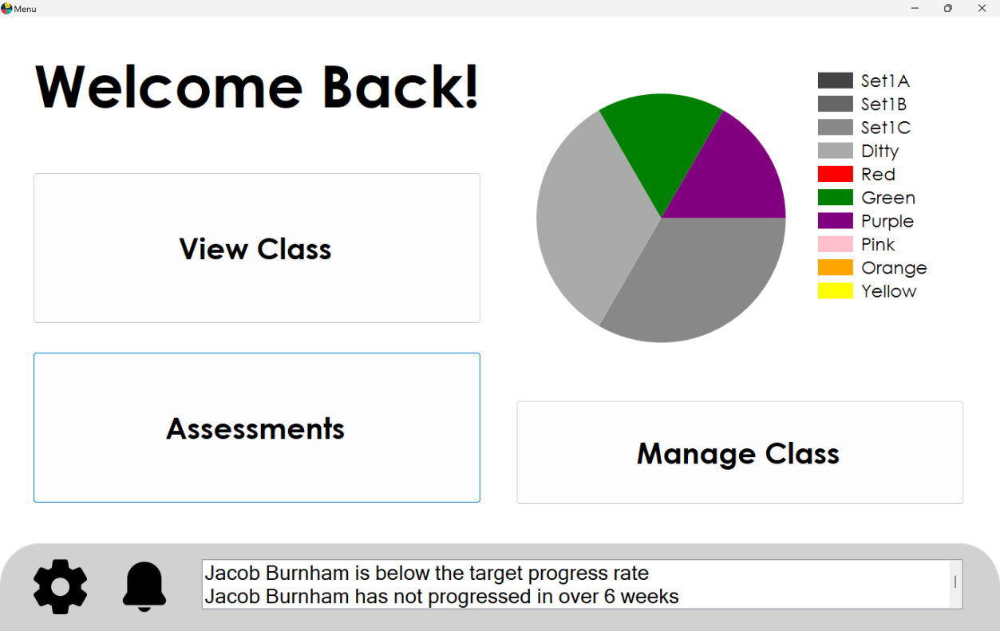
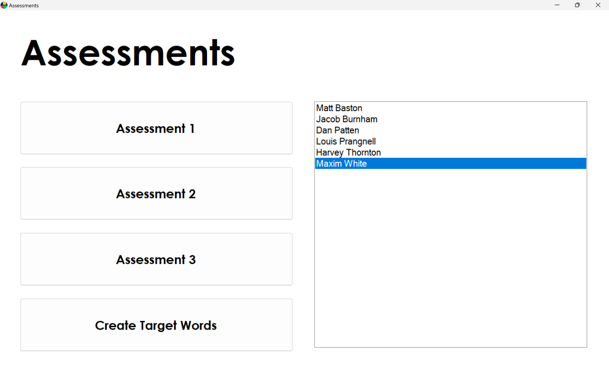
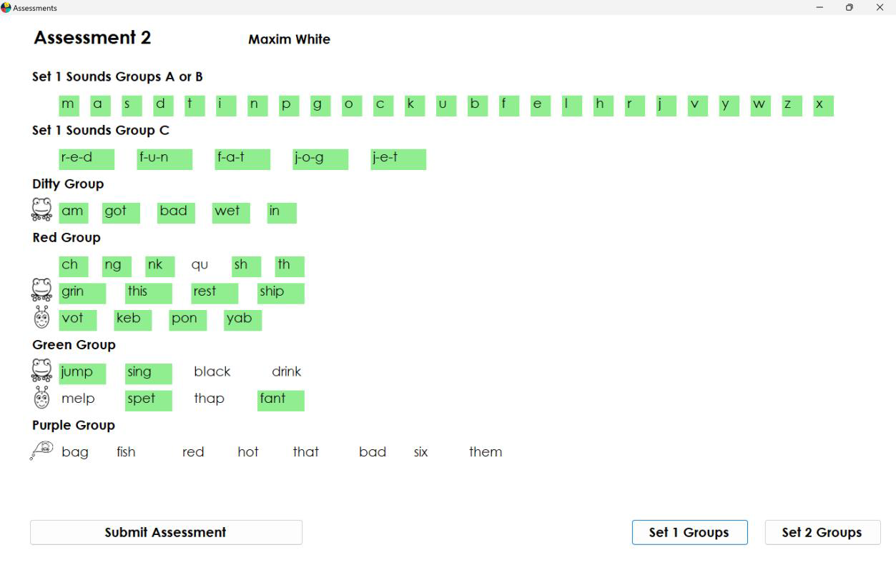
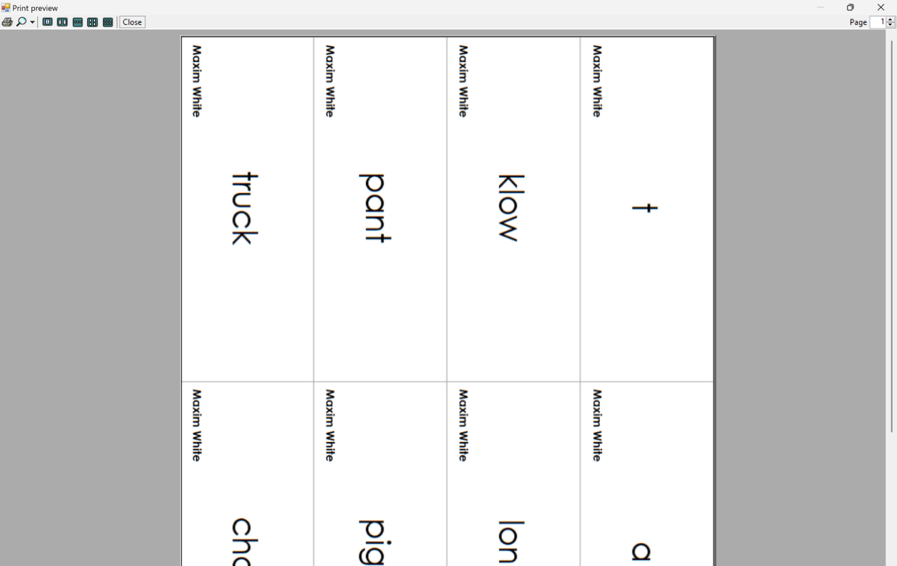
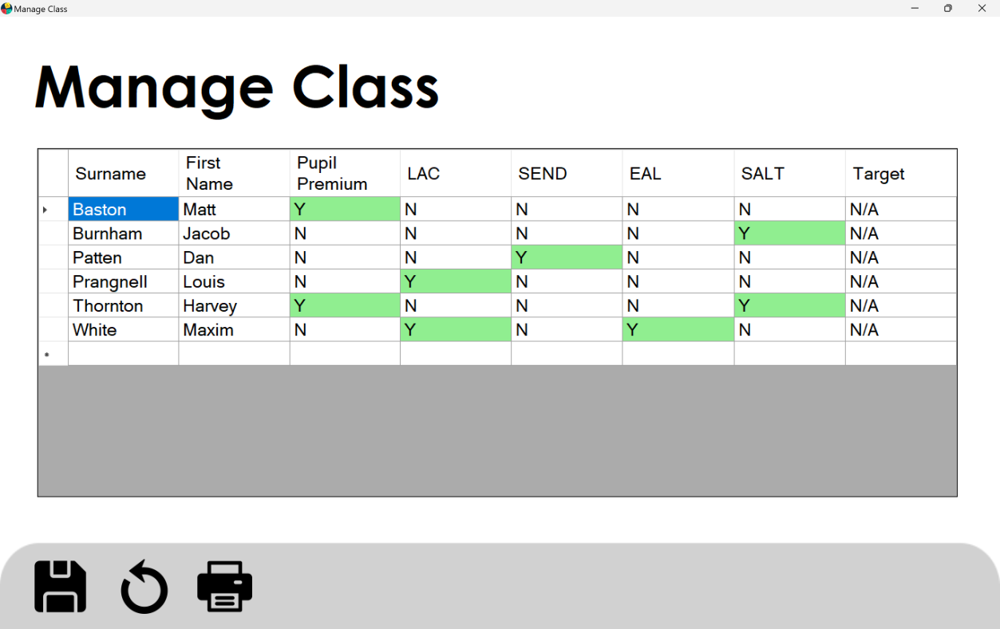
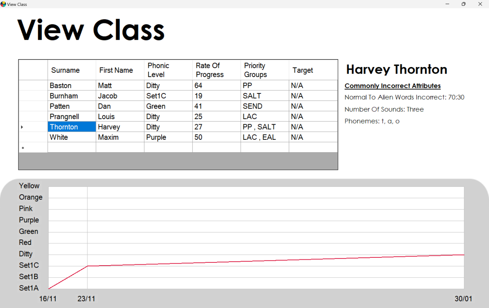

# Phonics-Teaching-and-Learning-Tool

## A VB.NET tool which performs assessment, progress tracking, and personalized worksheet generation following the Read Write Inc. phonics programme for EYFS and KS1.

This tool focuses on the assessment, the progress tracking, and the targeted learning of students. Assessments performed on the tool are analysed and attributes which students make mistakes on such as digraphs, phonemes, number of sounds, etc. are recorded as well as their phonics level and date of assessment. This allows the teacher to track the progress of their students and see summaries of what they find the most difficult. As well as this, the tool can generate and print unique practice words and sounds for students which will target the areas in which they struggle the most. A full list of functions is detailed below:

* Perform Read Write Inc. assessments digitally and automatically determine a student's phonics level
* Automatically generate practice worksheets tailored to students based on their phonics level and previous mistakes
* Print generated practice worksheets
* View students' progress through the phonics levels via a line graph
* View students' most common mistakes
* View the distribution of class phonics levels via a pie chart
* Show notifications if a student's progress falls below a certain level
* Log students' special educational needs and targets
* Print the class list showing students' special educational needs and targets

## Screenshots

This screenshot shows the home screen where the distribution of the phonics levels of the class can be viewed along with progress notifications. This is the main screen to navigate to other parts of the program.

This screenshot shows the choose assessments screen where official Read Write Inc. assessments can be started along with generating a target words worksheet.

This screenshot shows the assessments screen which is laid out in the same format and uses the same content as the official Read Write Inc. assessments. Correct words / phonemes are marked by clicking on them to become highlighted.

This screenshot shows the print dialog for a custom worksheet which displays up to 8 phonemes / words along with the name of the student in the corner. The lines can be cut along in order to create flashcards.

This screenshot shows the manage class screen where the teacher can log special educational needs and targets. This table can also be printed.

This screenshot shows the view class screen where the teacher can view each student's progress in the form of a graph and their most common mistakes. 